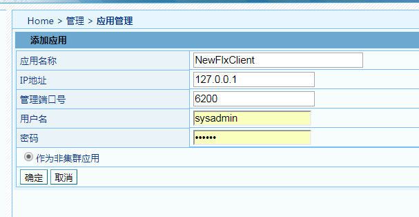

# 子站福利行安装

### 1 解压FlxClient.zip 文件。

解压后目录结构如下：

```text
apache-tomcat-7.0.54
apps_config
jre
startServer.cmd
stopServer.cmd
```

### 2 修改启动文件。

用记事本打开startServer.cmd, 文件修改如下：

```text
##修改JAVA_HOMED地址，为:解压当前目录/jre
set JAVA_HOME=d:\primeton\platform/ide/eclipse/jre   
##修改CATALINA_BASE地址，为:解压当前目录/apache-tomcat-7.0.54
set CATALINA_BASE=d:\primeton\platform/apache-tomcat-7.0.54
##修改外置目录EXTERNAL_CONFIG_DIR地址，为:解压当前目录/apps_config
set EXTERNAL_CONFIG_DIR=d:\primeton\platform/apps_config
```

修改完成后启动，本机访问：http://localhost:8080/FlxClient，系统管理员默认账号密码为：sysadmin/000000

### 3 修改数据库配置。

进入 解压目录/apps\_config/FlxClient/config/user-confg.xml ，修改如下第三行：DatabaseName为数据库名；修改如下第6行为数据库名可访问的用户；修改如下第7行为数据库用户对应密码。

```text
<group name="default">
    <configValue key="Database-Type">SQLServer</configValue>
    <configValue key="Jdbc-Type"/>
    <configValue key="C3p0-DriverClass">com.microsoft.sqlserver.jdbc.SQLServerDriver</configValue>
    <configValue key="C3p0-Url">jdbc:sqlserver://192.168.2.216;DatabaseName=flxDB30test6;SelectMethod=Cursor</configValue>
    <configValue key="C3p0-UserName">sa</configValue>
    <configValue key="C3p0-Password">{3DES}oYOUBB0xXo6mYQfWHZpEOz4YYyIsC6IVqr7k0YblcTb8</configValue>
    <configValue key="C3p0-PoolSize">5</configValue>
    <configValue key="C3p0-MaxPoolSize">5</configValue>
    <configValue key="C3p0-MinPoolSize">5</configValue>
    <configValue key="Transaction-Isolation">ISOLATION_DEFAULT</configValue>
    <configValue key="Test-Connect-Sql">SELECT count(*) from EOS_UNIQUE_TABLE</configValue>
    <configValue key="Retry-Connect-Count">-1</configValue>
</group>
```

### 4 修改文件相关地址：

1. 修改key=“importpath“标签值为当前系统用于存放上传excel文件目录;
2. 修改key=“exportpath“标签值为当前系统导出excel文件目录；
3. 修改key="filepaht"标签值为系统存储附件目录。

```text
<group name="excel">
    <configValue key="importpath">d:/fileupload/</configValue>
    <configValue key="exportpath">d:/exporttemp/</configValue>
    <!-- EXCEL模板路径相对路径 -->
    <configValue key="excel_template_path">excel-config/</configValue>
    <configValue key="excel_export_maxnum">10000</configValue>
    <!-- 百付去掉凭证excel模板名称 -->
    <configValue key="baifu_template_name">baifu.xls</configValue>
</group>
<group name="fileupload">
    <configValue key="filepath">d:/upload/</configValue>
</group>
```

### 5 修改governor管理员用户名和密码。

进入\apache-tomcat-7.0.54\webapps\governor\WEB-INF,打开governor.xml文件，修改UserName和Password。修改完成后启动服务器，访问：http://localhost:8080/governor 使用新的账户名和密码登录，登录成功则代表修改账户密码成功。

```text
<?xml version="1.0" encoding="UTF-8" standalone="no"?>
<governor>
    <module name="UserManager">
        <group name="Default">
            <configValue key="UserName">sysadmin</configValue>
            <configValue key="Password">{SHA1}C984AED014AEC7623A54F0591DA07A85FD4B762D</configValue>
        </group>
    </module>
</governor>

```

### 6 应用改名

系统默认应用名为FlxClient，如果特殊情况需要修改应用名步骤如下：

1. 进入解压目录下\apache-tomcat-7.0.54\webapps，修改该目录下：FlxClient为新的应用名例如：NewFlxClient。
2. 进入解压目录下\apps\_config,，修改该目录下FlxClient为新的应用名NewFlxClient。
3. 重启应用（关闭启动窗口，然后双击startup.bat），访问：http://localhost:8080/governor 输入账号密码进入。
4. 删除老应用：从左侧菜单进入：管理-&gt;应用功能，当前系统显示一条应用数据，勾选该应用，点击删除应用按钮，删除该应用。
5. 添加新应用：同样在应用功能界面，点击增加应用按钮，打开应用添加界面，输入要素如下：

| 应用名称 | 修改后新应用名称 |
| :--- | :--- |
| IP地址 | 对应应用所在ip地址，正常单机部署地址统一填写127.0.0.1 |
| 管理端口号 | 应用访问端口，获取方式：打开访问目录\apps\_config\NewFlxClient\startup.conf 中AdminPort值。 |
| 用户名 | sysadmin 不变 |
| 密码 | 000000 |




